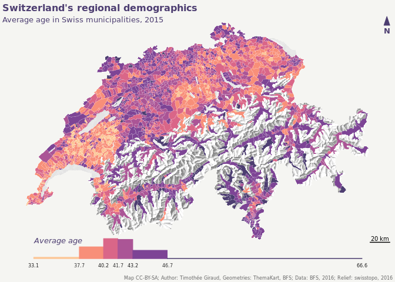

``` r
# packages nécessaires
library(rgdal)
```

    ## Loading required package: sp

    ## rgdal: version: 1.2-4, (SVN revision 643)
    ##  Geospatial Data Abstraction Library extensions to R successfully loaded
    ##  Loaded GDAL runtime: GDAL 2.1.2, released 2016/10/24
    ##  Path to GDAL shared files: /usr/local/share/gdal
    ##  Loaded PROJ.4 runtime: Rel. 4.9.2, 08 September 2015, [PJ_VERSION: 492]
    ##  Path to PROJ.4 shared files: (autodetected)
    ##  Linking to sp version: 1.2-3

``` r
library(raster)
library(cartography)

# import des données 
gde_15 <- readOGR("input/geodata/gde-1-1-15.shp", layer = "gde-1-1-15")
```

    ## OGR data source with driver: ESRI Shapefile 
    ## Source: "input/geodata/gde-1-1-15.shp", layer: "gde-1-1-15"
    ## with 2324 features
    ## It has 2 fields
    ## Integer64 fields read as strings:  BFS_ID

``` r
relief <- raster("input/geodata/02-relief-georef-clipped-resampled.tif")
age <- read.csv("input/avg_age_15.csv", stringsAsFactors = F)

# pour l'export de la carte
# png("chuiche.png", width = 600, height = 440, res = 96)

# j'utilise la police "liberation" qui est une police libre 
# https://en.wikipedia.org/wiki/Liberation_fonts
par(mar = c(3,0.2,1.2,0.2), bg = "#f5f5f2", family = "liberation")

# affichage du relief
bb <- extent(relief)
plot.new()
plot.window(xlim = bb[1:2], ylim = bb[3:4], asp = TRUE)
plot(relief, legend = FALSE, axes = FALSE, box = FALSE,
     col = colorRampPalette(c("grey50","white"))(25),
     add = TRUE)

# discrétisation de la variable
# j'utilise la méthode "q6" qui permet de bien 
# distinguer les valeurs extrèmes
# ?getBreaks
bks <- getBreaks(v = age$avg_age_15, method = "q6")

# choix d'une gamme de couleur
cols <- c("#FCC696", "#F88F79", "#DA6688", 
          "#AB5596", "#7D4495", "#4D3E71")

# affichage de l'age moyen
choroLayer(spdf = gde_15, df = age, 
           spdfid = "BFS_ID", dfid = "bfs_id", 
           var = "avg_age_15", method = "q6", col = cols, 
           border = "white", lwd = 0.2, legend.pos = "n",
           add = TRUE )

# ajout d'une échelle et d'une flèche nord
north(col = "#4D3E71")
barscale(size = 20)

# ajout du titre, sous titre et sources.
mtext(text = "Switzerland's regional demographics", 
      side = 3, line = 0,adj = 0, col = "#4D3E71", font = 2)
mtext(text = "Average age in Swiss municipalities, 2015", 
      side = 3, line = - 1,adj = 0, cex = 0.8, col = "#4D3E71" )
mtext(text = "Map CC-BY-SA; Author: Timothée Giraud, Geometries: ThemaKart, BFS; Data: BFS, 2016; Relief: swisstopo, 2016",
      side = 1, line = 2,adj = 1, cex = 0.5, col = "grey40" )


# J'utilise la méthode décrite ici (https://rgeomatic.hypotheses.org/878)
# pour insérer un histogramme dans la carte. 
par(fig = c(grconvertX(c(480000, 840000), from="user", to="ndc"),
            grconvertY(c(55000,  77000) , from="user", to="ndc")),
    mar = c(0,0,0,0),  
    new = TRUE)

# ajout d'un histogramme qui servira de légende
hist(age$avg_age_15, probability = T, breaks = bks, 
     col = cols, axes = F, xlab="", ylab = "",
     main = "", border = cols)
axis(side = 1, at = bks[c(1,3,5,7)], labels = round(bks[c(1,3,5,7)], 1),
     cex.axis = 0.5, tick = FALSE, line = -1.1, col.axis = "grey10")
axis(side = 1, at = bks[c(2,4,6)], labels = round(bks[c(2,4,6)], 1),
     cex.axis = 0.5, tick = FALSE, line = -1.1, col.axis  = "grey20")
text(x = 33.1, y = 0.16, label = "Average age", cex = 0.8, adj = c(0,1), 
     font = 3, col = "#4D3E71")
```



``` r
# dev.off()


sessionInfo()
```

    ## R version 3.3.2 (2016-10-31)
    ## Platform: x86_64-pc-linux-gnu (64-bit)
    ## Running under: Ubuntu 16.04.1 LTS
    ## 
    ## locale:
    ##  [1] LC_CTYPE=fr_FR.UTF-8       LC_NUMERIC=C              
    ##  [3] LC_TIME=fr_FR.UTF-8        LC_COLLATE=fr_FR.UTF-8    
    ##  [5] LC_MONETARY=fr_FR.UTF-8    LC_MESSAGES=fr_FR.UTF-8   
    ##  [7] LC_PAPER=fr_FR.UTF-8       LC_NAME=C                 
    ##  [9] LC_ADDRESS=C               LC_TELEPHONE=C            
    ## [11] LC_MEASUREMENT=fr_FR.UTF-8 LC_IDENTIFICATION=C       
    ## 
    ## attached base packages:
    ## [1] stats     graphics  grDevices utils     datasets  methods   base     
    ## 
    ## other attached packages:
    ## [1] cartography_1.4.1 raster_2.5-8      rgdal_1.2-4       sp_1.2-3         
    ## 
    ## loaded via a namespace (and not attached):
    ##  [1] Rcpp_0.12.8.2      lattice_0.20-34    class_7.3-14      
    ##  [4] digest_0.6.10      rprojroot_1.1      grid_3.3.2        
    ##  [7] backports_1.0.4    magrittr_1.5       e1071_1.6-7       
    ## [10] evaluate_0.10      stringi_1.1.2      rmarkdown_1.2.9000
    ## [13] tools_3.3.2        stringr_1.1.0      yaml_2.1.14       
    ## [16] classInt_0.1-23    rgeos_0.3-21       htmltools_0.3.5   
    ## [19] knitr_1.15.1
